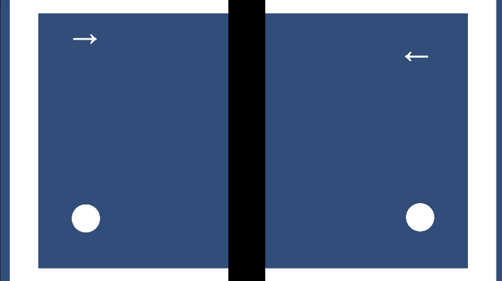

# portfolio
# ポートフォリオ
- 山田健太

## 資格
- 情報技術検定2級
- パソコン利用技術検定2級

## スキル
- C言語
    - 利用歴2年
- unity
    - 利用歴１年
    - オリジナルゲームの作成経験あり
- Google　Apps　Sqript（GAS）
    - データ管理システムの共同開発経験あり
## 取り組んでいるテーマ
1.オリジナルゲーム企画

 
## 作品リスト
- はこよけ
 
 球体を左右に動かし壁をよける 

- ミラーミー
 
 移動が左右反転している球体を動かして進む 
 横スクロールのゲーム(未完成)

*連絡先　yamapaper2234@gmail.com